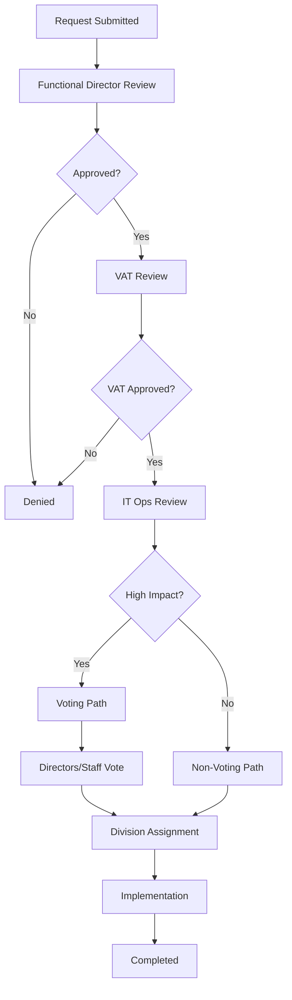

# HRC Change Release Management (CRMA) Application

<div align="center">


**A comprehensive ServiceNow application for the U.S. Army Human Resources Command to manage Digital Requirements Review Board (DRRB) processes with complex approval workflows and professional dashboard capabilities.**

[🎯 **LIVE DEMO**](https://demoalectriallwfzu137920.service-now.com/x_snc_hrc_change_2_dashboard.do) • [📋 **DRRB Requests**](https://demoalectriallwfzu137920.service-now.com/x_snc_hrc_change_2_drrb_list.do?sysparm_clear_stack=true) • [📚 **Documentation**](#documentation)

</div>

---

## 🌟 Overview

The HRC Change Release Management (CRMA) Application streamlines the Digital Requirements Review Board (DRRB) process for the U.S. Army Human Resources Command. It provides a comprehensive workflow management system with automated routing, approval processes, and real-time tracking capabilities.

### ✨ Key Features

- **🔄 Complex Approval Workflows**: Automated routing through Functional Director → VAT → IT Ops → Voting/Division Assignment
- **📊 Interactive Dashboard**: Professional Army-themed interface with drill-down capabilities
- **🎯 Dual-Path Processing**: Intelligent routing between Voting Path (high-impact) and Non-Voting Path (routine)
- **🛡️ Role-Based Security**: 11 specialized roles with granular ACL controls
- **📱 Mobile-Responsive**: Optimized for desktop and mobile access
- **⚡ Real-Time Updates**: Live status tracking and notifications

---

## 🚀 Quick Start

### Prerequisites

- ServiceNow Instance (Yokohama release or later)
- ServiceNow SDK 4.2.0+
- Node.js 16+ (for development)

### 🎯 Access the Application

| Component | URL | Description |
|-----------|-----|-------------|
| **🎯 Main Dashboard** | [**HRC CRMA Dashboard**](https://demoalectriallwfzu137920.service-now.com/x_snc_hrc_change_2_dashboard.do) | Interactive dashboard with drill-down widgets |
| **📋 DRRB Requests** | [**Request Management**](https://demoalectriallwfzu137920.service-now.com/x_snc_hrc_change_2_drrb_list.do?sysparm_clear_stack=true) | Full CRUD operations on DRRB records |
| **🖥️ Application Systems** | [**System Configuration**](https://demoalectriallwfzu137920.service-now.com/x_snc_hrc_change_2_application_system_list.do?sysparm_clear_stack=true) | Manage reference systems |
| **📝 Briefing Types** | [**Type Management**](https://demoalectriallwfzu137920.service-now.com/x_snc_hrc_change_2_type_of_briefing_list.do?sysparm_clear_stack=true) | Configure briefing categories |

---

## 🏗️ Architecture

### 📁 Project Structure

```
src/
├── client/                          # React Frontend
│   ├── index.html                   # HTML entry point
│   ├── main.jsx                     # React bootstrap
│   ├── app.jsx                      # Main application component
│   ├── app.css                      # Army-themed styles
│   ├── components/
│   │   ├── DashboardOverview.jsx    # Interactive dashboard
│   │   ├── DRRBList.jsx            # Request listing
│   │   └── DRRBForm.jsx            # Create/Edit forms
│   ├── services/
│   │   └── DRRBService.js          # API service layer
│   └── utils/
│       └── fields.js               # ServiceNow field utilities
├── fluent/                          # ServiceNow Fluent DSL
│   ├── tables/                      # Data model definitions
│   │   ├── drrb.now.ts             # Main DRRB table
│   │   ├── application_system.now.ts # Reference systems
│   │   └── type_of_briefing.now.ts # Briefing types
│   ├── roles/
│   │   └── crma_roles.now.ts       # 11 user roles
│   ├── acls/
│   │   └── table_acls.now.ts       # Security controls
│   ├── business-rules/
│   │   └── drrb-workflow-rules.now.ts # Workflow automation
│   ├── ui-pages/
│   │   └── dashboard.now.ts        # UI Page definition
│   └── records/
│       └── sample_data.now.ts      # Demo data
└── server/
    └── drrb-workflow.js            # Server-side logic
```

### 🎯 Core Components

#### **Data Model**
- **DRRB Table**: Main request tracking with 10 workflow states
- **Application/System**: Reference data for AV-KNOX-HRC, CUI-HRC, DCIPS, EDES, EPMDTK
- **Type of Briefing**: Information, Guidance, Decision categories

#### **Security Model**
- **11 User Roles**: From Requesting Functional to CRMA Admin
- **12 ACL Rules**: Granular CRUD permissions
- **Role Hierarchy**: Proper containment relationships

#### **Workflow Engine**
- **5 Business Rules**: State transitions and validation
- **Automated Priority**: Calculated based on content analysis  
- **Dual-Path Logic**: Voting vs Non-Voting determination

---

## 🎨 User Interface

### 🎯 Dashboard Features

<div align="center">

| Feature | Description | Interaction |
|---------|-------------|-------------|
| **📊 Status Cards** | Real-time counts of requests by status | Click to drill down |
| **📈 Workflow States** | Visual breakdown of all 10 workflow states | Click any state to filter |
| **🏢 Division Workload** | Current assignments across 5 divisions | Click to see division requests |
| **⭐ Priority Distribution** | Requests by priority with visual bars | Click any priority to filter |
| **📋 Recent Activity** | Latest requests with quick access | Click to view details |
| **🚨 High Priority Alerts** | Priority 1-2 requests needing attention | Click for immediate details |

</div>

### 🎨 Army Professional Theme

- **Primary Colors**: Black (#000000) for authority
- **Accent Colors**: Gold (#FFD700) for Army heritage  
- **Supporting Colors**: Professional gray tones
- **Typography**: Clean, military-standard fonts
- **Layout**: Minimal clutter, maximum functionality

---

## 👥 User Roles & Permissions

| Role | Permissions | Workflow Responsibility |
|------|-------------|------------------------|
| **Requesting Functional** | Create, Read own requests | Submit DRRB requests |
| **Functional Director** | Read, Update (approve/deny) | First-level approval |
| **VAT Member** | Read, Update VAT reviews | Technical architecture review |
| **IT Operations** | Read, Update, Route | Determine voting vs non-voting path |
| **Directors/Staff** | Read, Update, Vote | Enterprise-level prioritization |
| **Division Teams** (ID/GPD/ADMD/G3/G6) | Read, Update assigned | Implementation and delivery |
| **CRMA Admin** | Full CRUD, Configuration | System administration |

---

## 🔄 Workflow Process



### 🎯 Path Determination Logic

**Voting Path Criteria** (High-Impact):
- Priority 1-2 requests
- Financial implications
- Pay system impacts
- Large customer base affected
- Enterprise initiatives

**Non-Voting Path** (Routine):
- Priority 3-5 requests
- Standard operational changes
- Limited scope impact
- Routine maintenance

---

## 🛠️ Installation

### Option 1: ServiceNow Store (Recommended)
1. Access ServiceNow Store
2. Search for "HRC CRMA"
3. Install to your instance
4. Configure user roles

### Option 2: Manual Installation
```bash
# Clone repository
git clone https://github.com/yourusername/hrc-crma-application.git

# Install ServiceNow SDK
npm install -g @servicenow/sdk

# Navigate to project
cd hrc-crma-application

# Install dependencies
npm install

# Build application
npm run build

# Deploy to instance
npm run deploy
```

### Option 3: Import Update Set
1. Download latest update set from [Releases](../../releases)
2. Import to your ServiceNow instance
3. Commit update set
4. Assign appropriate roles to users

---

## 📖 Usage Guide

### 🎯 For Requesting Functional Users

1. **Access Dashboard**: Navigate to CRMA Dashboard
2. **Create Request**: Click "Create Request" button
3. **Fill Details**: Complete Title, Description, Directorate
4. **Submit**: Request enters "Pre-Approval" state
5. **Track Progress**: Monitor through dashboard widgets

### 🎯 For Functional Directors

1. **Review Queue**: Access pending requests
2. **Evaluate Request**: Review business justification
3. **Make Decision**: Approve (→ VAT) or Deny with comments
4. **Add Notes**: Provide feedback in work notes

### 🎯 For VAT Members

1. **Technical Review**: Evaluate architecture requirements
2. **Assessment**: Check alignment with enterprise standards
3. **Decision**: Approve (→ IT Ops) or Deny with technical rationale

### 🎯 For IT Operations

1. **Operational Review**: Assess implementation requirements
2. **Path Determination**: System automatically suggests voting vs non-voting
3. **Routing**: Assign to appropriate division based on expertise
4. **Coordination**: Manage inter-division dependencies

---

## 🔧 Configuration

### 🎯 Environment Variables

| Variable | Description | Default |
|----------|-------------|---------|
| `CRMA_INSTANCE_URL` | ServiceNow instance URL | - |
| `CRMA_SCOPE` | Application scope | `x_snc_hrc_change_2` |
| `CRMA_DEBUG` | Enable debug logging | `false` |

### 🎯 Business Rules Configuration

- **Priority Calculation**: Modify `src/server/drrb-workflow.js`
- **State Transitions**: Update `src/fluent/business-rules/drrb-workflow-rules.now.ts`
- **Notification Settings**: Configure in Business Rules

### 🎯 UI Customization

- **Colors**: Modify CSS variables in `src/client/app.css`
- **Dashboard Widgets**: Edit `src/client/components/DashboardOverview.jsx`
- **Forms**: Customize `src/client/components/DRRBForm.jsx`

---

## 🧪 Testing

### Unit Tests
```bash
npm run test
```

### Integration Tests
```bash
npm run test:integration
```

### ServiceNow ATF Tests
- Navigate to **Automated Test Framework**
- Run test suite: **CRMA Workflow Tests**
- Validate all approval paths

---

## 🤝 Contributing

We welcome contributions from the ServiceNow developer community!

### 🎯 Development Setup

1. **Fork the repository**
2. **Create feature branch**: `git checkout -b feature/amazing-feature`
3. **Install dependencies**: `npm install`
4. **Make changes**: Follow coding standards
5. **Test thoroughly**: Run all test suites
6. **Commit changes**: `git commit -m 'Add amazing feature'`
7. **Push to branch**: `git push origin feature/amazing-feature`
8. **Open Pull Request**: Describe changes and impacts

### 🎯 Coding Standards

- **ServiceNow Fluent**: Follow official DSL patterns
- **React Components**: Functional components with hooks
- **CSS**: Use CSS custom properties for theming
- **JavaScript**: ES6+ features, JSDoc comments
- **Testing**: Minimum 80% code coverage

### 🎯 Pull Request Process

1. Ensure all tests pass
2. Update documentation as needed
3. Add screenshots for UI changes
4. Get approval from code reviewers
5. Squash commits before merge

---

## 📊 Roadmap

### 🎯 Version 2.0 (Planned)
- [ ] **Advanced Analytics**: Power BI integration
- [ ] **Mobile App**: Native iOS/Android applications  
- [ ] **AI Insights**: Machine learning for priority prediction
- [ ] **External Integration**: SAP/Oracle connector
- [ ] **Advanced Reporting**: Custom dashboard builder

### 🎯 Version 2.1 (Future)
- [ ] **Workflow Designer**: Visual workflow configuration
- [ ] **Document Management**: Integrated file handling
- [ ] **Audit Trail**: Enhanced compliance tracking
- [ ] **Performance Metrics**: SLA tracking and reporting

---

## 📄 License

This project is licensed under the **U.S. Government Work License** - see the [LICENSE.md](LICENSE.md) file for details.

### Important Notes:
- This software was developed for the U.S. Army Human Resources Command
- Usage restrictions may apply for non-government entities
- Contributions are subject to security review processes
- Export control regulations may apply

---

## 🙋‍♂️ Support & Contact

### 🎯 Technical Support

- **📧 Email**: hrc.crma.support@army.mil
- **📞 Phone**: (502) 626-CRMA (2762)
- **🎫 Help Desk**: Submit ticket through IT Service Portal
- **💬 Teams**: HRC-CRMA-Support channel

### 🎯 Development Team

| Role | Contact | Responsibility |
|------|---------|---------------|
| **Technical Lead** | tech.lead@army.mil | Architecture & Development |
| **Product Owner** | product.owner@army.mil | Requirements & Priorities |
| **ISSO** | security.officer@army.mil | Security & Compliance |

### 🎯 Contributing & Issues

- **🐛 Bug Reports**: [GitHub Issues](../../issues)
- **💡 Feature Requests**: [GitHub Discussions](../../discussions)
- **📝 Documentation**: [GitHub Wiki](../../wiki)
- **🔒 Security Issues**: security.officer@army.mil (Private)

---

## 🏆 Acknowledgments

- **U.S. Army Human Resources Command** - Requirements and domain expertise
- **ServiceNow Platform Team** - Technical platform support
- **Enterprise Modernization Directorate** - Architectural guidance
- **Army IT Community** - User feedback and testing

---

<div align="center">

**Built with ❤️ for the U.S. Army Human Resources Command**


**[⭐ Star this repo](../../stargazers) • [🍴 Fork it](../../network/members) • [📋 Report Issues](../../issues) • [💬 Discussions](../../discussions)**

</div>